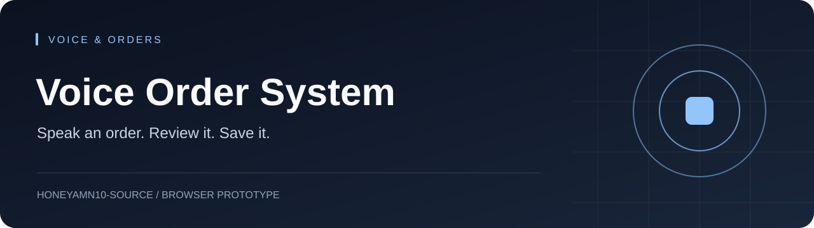

<p align="center"></p>

<h1 align="center">Voice Order System</h1>
<p align="center"><strong>Speak an order. Review it. Save it.</strong></p>
<p align="center"><a href="#project-at-a-glance">Overview</a> · <a href="#start-here">Start here</a> · <a href="#project-guide">Project guide</a> · <a href="https://github.com/honeyamn10-source/voice-order-system/issues">Issues</a></p>

[](https://github.com/honeyamn10-source/voice-order-system/actions/workflows/blank.yml)

Browser speech, conversational order capture and backend persistence.

## Project at a glance

| Current scope | Release boundary |
| --- | --- |
| **Browser prototype** | Telephone integration is not implemented by the browser speech flow. |

## Start here

Use the setup commands in the project guide below. Check configuration and current workflow results before deploying.

## Project guide

## ✨ Features

- 🎙️ **Full voice loop** — Speech → AI → Speech, no typing required
- 🔁 **Guided order flow** — collects items, name, phone and pickup time one field per turn
- 🧠 **Model fallback** — OpenRouter with Mistral Nemo (and automatic fallback)
- 💾 **Structured persistence** — orders saved to Supabase when `[SAVE_ORDER:{...}]` is detected
- 📊 **Dashboard-ready** — `recent_orders` and `daily_summary` views for reporting
- ⚡ **Zero-cost backend checks** — CI validates syntax and request handling with mocked responses

## 🚀 How it works

```
User speaks
    │  Web Speech API (browser built-in)
    ▼
Text sent to Vercel /api/converse
    │  OpenRouter → Mistral Nemo (with model fallback)
    ▼
Alex's reply text returned
    │  If [SAVE_ORDER:{...}] detected → Supabase insert
    ▼
Reply text spoken aloud via SpeechSynthesis API
    │  Mic re-activates automatically
    ▼
Repeat until order saved
```

### Order flow

Alex collects the order in four guided turns:

1. **Items** — pizza / burger / salad
2. **Customer name**
3. **Phone number**
4. **Pickup time** → confirms → saves to Supabase → browser session ends

## 📁 Repository layout

```
voice-order-system/
├── index.html              ← Frontend (deploy to GitHub Pages)
├── api/
│   └── converse.js         ← Backend handler (deploy to Vercel)
├── converse.js             ← Shared backend logic
├── vercel.json             ← Vercel configuration (auto-detected)
├── supabase_schema.sql     ← Run once in the Supabase SQL editor
├── tests/                  ← Node.js test suite (mocked model)
└── .github/workflows/      ← CI checks
```

## 🧪 Local checks

Requires **Node.js 22**.

```bash
npm run check     # syntax check for all server handlers
npm test          # handler tests with a mocked model response
```

No API keys or database are required for the checks — live speech recognition, model access and order persistence still need deployment acceptance testing.

## ☁️ Deployment

### Step 1 — Supabase

1. Go to [supabase.com](https://supabase.com) → your project → **SQL Editor**
2. Paste the contents of `supabase_schema.sql` and click **Run**
3. Go to **Settings → API** and copy the **Project URL** and the **anon / public key**

### Step 2 — Vercel (backend)

1. Push this repository to GitHub
2. New project at [vercel.com](https://vercel.com) → import the repository
3. Add the environment variables:

   | Variable             | Value                                  |
   | -------------------- | -------------------------------------- |
   | `OPENROUTER_API_KEY` | Your key from [openrouter.ai](https://openrouter.ai) |
   | `SUPABASE_URL`       | Your Supabase project URL              |
   | `SUPABASE_ANON_KEY`  | Your Supabase anon key                 |

4. Deploy and copy your Vercel URL (e.g. `https://myshop.vercel.app`)

### Step 3 — Frontend (GitHub Pages)

1. Open `index.html`
2. Find `const BACKEND = 'https://YOUR-PROJECT.vercel.app/api/converse';`
3. Replace it with your actual Vercel URL
4. Push to your GitHub Pages repository and enable Pages
5. Visit your GitHub Pages URL to test the conversation

## 📊 Dashboard queries

```sql
-- Recent orders
SELECT * FROM recent_orders;

-- Daily summary
SELECT * FROM daily_summary;
```

## ⚠️ Voice support

The frontend relies on browser speech recognition and speech synthesis. Availability and microphone permissions vary by browser and device — verify recognition, playback, and saved orders on your target devices. This project is a browser voice interface, **not** a verified telephone integration.

## 🛡️ Security

- No keys are stored client-side; backend keys live in Vercel environment variables
- Supabase Row Level Security should be enabled on production tables
- See [SECURITY.md](SECURITY.md) for the vulnerability reporting policy

## 🤝 Contributing

Contributions are welcome. Read [CONTRIBUTING.md](CONTRIBUTING.md) first, and review the [Code of Conduct](CODE_OF_CONDUCT.md).

## 📄 License

[MIT](LICENSE) © 2026 [Bittu Sharma](https://github.com/honeyamn10-source)
