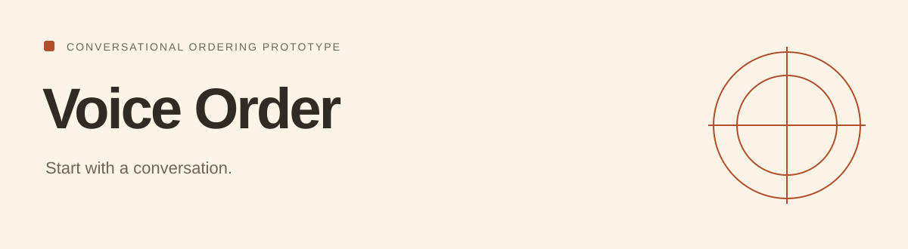

# Voice Order

<!-- repo-badges:start -->
<div align="center">

[](https://github.com/honeyamn10-source/voice-order-system/stargazers)
[](https://github.com/honeyamn10-source/voice-order-system/forks)
[](https://github.com/honeyamn10-source/voice-order-system/issues)
[](https://github.com/honeyamn10-source/voice-order-system/commits/main)

[Repository](https://github.com/honeyamn10-source/voice-order-system) · [Issues](https://github.com/honeyamn10-source/voice-order-system/issues) · [Pull Requests](https://github.com/honeyamn10-source/voice-order-system/pulls) · [Actions](https://github.com/honeyamn10-source/voice-order-system/actions)

</div>
<!-- repo-badges:end -->


A browser voice interface with a serverless conversation endpoint and a small restaurant menu.

[Project website](https://honeyamn10-source.github.io/voice-order-system/) · [Build results](https://github.com/honeyamn10-source/voice-order-system/actions)

## What it does

- **Listen and review.** The browser interface handles the conversation and shows the order.
- **Validate menu items.** The server filters known items and recalculates the total.
- **Save the request.** A configured database stores the order; the API reports whether saving succeeded.

## Start from source

Node.js and a Vercel-compatible server runtime. Configure OPENROUTER_API_KEY, SUPABASE_URL and SUPABASE_ANON_KEY on the server.

```bash
git clone https://github.com/honeyamn10-source/voice-order-system.git
cd voice-order-system
npm test
# After configuring the server environment:
npx vercel dev
```

## Verify

```bash
npm test
```

## Scope

A prototype, not a connected phone line or payment system. Browser speech support varies. Serving the static HTML alone does not provide /api/converse.

## Find your way around

- [Order validation](converse.js)
- [Serverless entry point](api/converse.js)
- [Database schema](supabase_schema.sql)

## Contributing and license

See [CONTRIBUTING.md](CONTRIBUTING.md). Include a minimal reproduction and runtime versions with bug reports; remove credentials from logs.

MIT — see [LICENSE](LICENSE). Third-party dependencies retain their applicable licenses.
